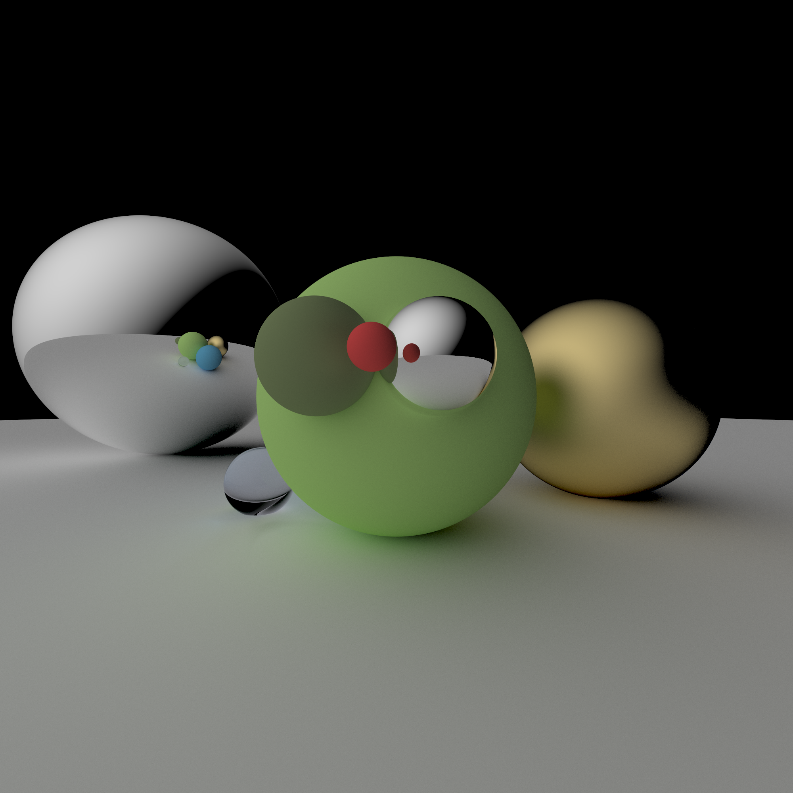

# cpp_raytracer

A simple raytracer adapted from Ray Tracing in One Weekend. This is implemented in C++, since the main goal was to practice C++. I will likely write a more capable renderer in Rust later.

Example image:

# usage

`main.cpp` should hopefully be self explanatory for you to change resolution, samples, and the scene. Render an image by running `make`.
